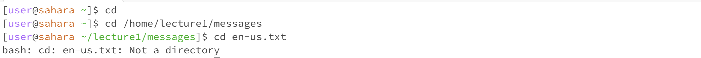
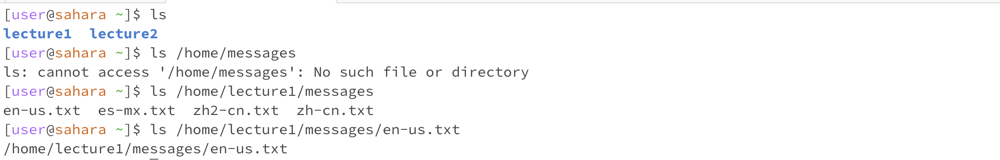
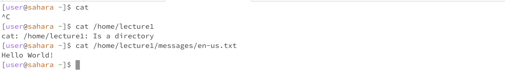

# cd command
* cd command is to change working directory, when using cd command without arguments, it will go to root directory.(No error) 
* If using cd command with a path to diretory, it will go to that working directroy(no error)
* If using cd command with a path to files, it will say it's not a directory(error occur)

# ls command
ls command is to show the list of files
If using ls command without arguments, it will show the list of files in current working directroy (no error)
If using ls command with a path to directory, it will show the list of files in that directory(no error)
If using ls command with a path to file, it repeat the path of that file. (error occur)

# cat command
cat command use to veiw or read the file.
Based on the test, if cat command with no argument, it will read rom stdin (no error)
if cat with argument, but it a directory, it will display it is directory. (error)
if cat with argument, and with a file, such as cat /home/lecture1/message/page.txt it will display what inside txt file.(no error)
