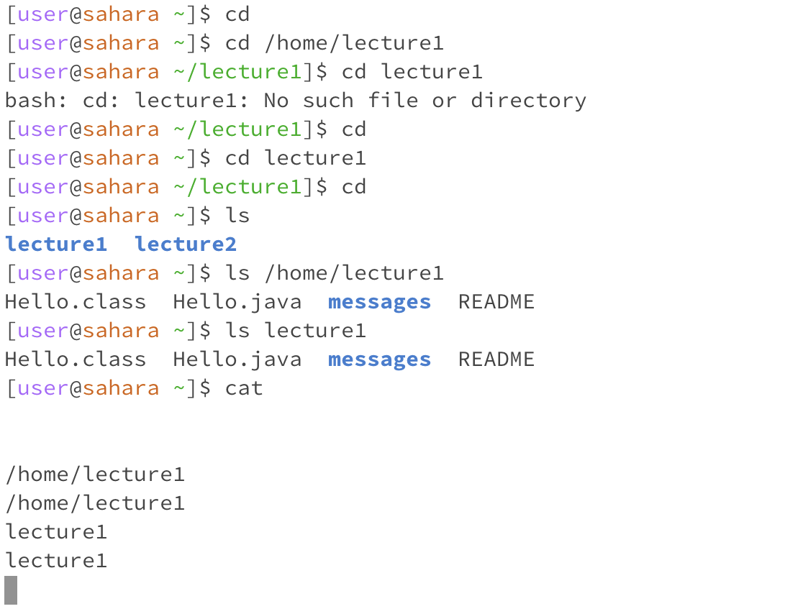

# cd command
cd command is to change working directory, when run empty, it will go to root directory.
If we have some path like /home/lecture1/message/page.txt, cd command with empty argument will return to /home directory
if command with argument, with path and files name, if only include files name, that must be in the current working directory
if no such files name, it return can't find files name, if with path, such as cd /home/lecture1/message, the working directory
will go to message file.

# ls command
Basically same as cd command, but it will display what file inside that path.
ls /home will display lecture1
ls will display lecture1  #if with no arugment, it will show file name under current working directory.
ls /home/lecture1 will display message

#cat command
cat command use to veiw or read the file.
Based on the test, if cat command with no argument, then the system start bug, need to restart terminal
if cat with argument, but it a directory, it will display it is directory.
if cat with argument, and with a file, such as cat /home/lecture1/message/page.txt it will display what inside txt file.
